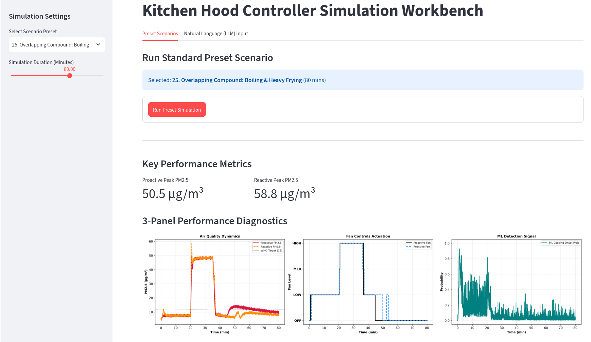
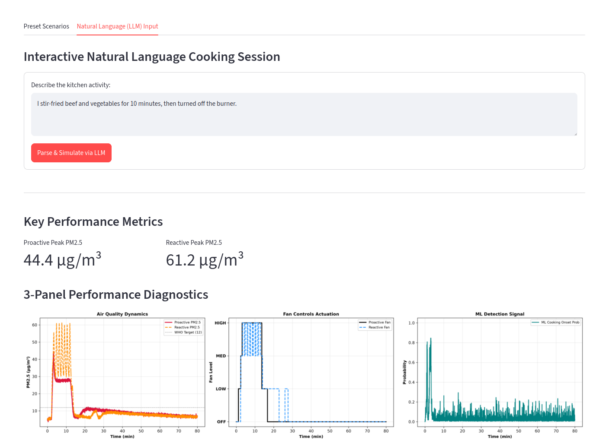

# Smart Range Hood Controller: ML Onset Detection & Physics-Based MPC Optimization

> **Project Scope & Intellectual Property Notice**
> This repository contains selected, IP-safe excerpts from the private, production-oriented project. Proprietary physics models, controller tuning, feature engineering, trained artifacts, raw telemetry, and detailed LLM prompts have been omitted or stubbed. The public showcase demonstrates the **system architecture, interfaces, and software engineering practices.**

---

## Architecture & Engineering Highlights

This repository serves as a showcase for production-ready MLOps practices, clean system boundaries, and robust API/frontend orchestration.

* **Structured LLM Orchestration & Deterministic Safety:** Integrates LangChain with Pydantic v2 schemas (`ParsedScenarioParams`) to enforce strict output typing from natural-language prompts. Raw GenAI outputs undergo deterministic parameter reconciliation before reaching downstream engines to guarantee runtime consistency.
* **Modular Clean Architecture:** Strict separation of concerns between presentation (`frontend/`), REST API orchestration (`api/`), execution engines (`src/`), simulation modules (`simulation/`), and training/data pipelines (`pipelines/`). Logic is decoupled via interfaces and dependency inversion.
* **Production MLOps Pipeline:** Utilizes Data Version Control (DVC) for reproducible data lineage and pipeline execution (`dvc.yaml`), paired with Optuna for structured hyperparameter optimization (`pipelines/train_optuna.py`).
* **Containerization & Multi-Environment Setup:** Targeted, lightweight Dockerfiles (`Dockerfile.api`, `Dockerfile.frontend`) and tiered Docker Compose configurations (`docker-compose.yml` vs. `docker-compose.prod.yml`) ensure consistent execution across local development and production environments.
* **Defensive Engineering & Layered QA:** Automated CI/CD GitHub Actions workflows covering linting (`Ruff`), type safety (`mypy`), code formatting, and multi-tier Pytest coverage (`tests/unit/` for isolated domain logic and `tests/integration/` for end-to-end API validation).

---

## System Overview

```text
                                +-------------------------+
                                |  Telemetry Sensor Data  |
                                +------------+------------+
                                            |
                                            v
    +---------------------------------------------------------------------------------+
    |                                  DVC Pipeline                                   |
    |    [preprocess_align] ---> [build_features] ---> [train_optuna] ---> MLflow     |
    +---------------------------+-----------------------------------------------------+
                                            |
                                            v
                                   +---------------------+
                                   |  Trained Artifacts  |
                                   +---------+-----------+
                                            |
                                            v
                                +----------------------------+
                                |    Simulation Engine       |
                                | (Physics MPC, ML detector, | 
                                |  & simulation environment) |
                                +-----------+----------------+
                                            ^
                                            |
                                            v
                                  +-----------------------+
                                  |      FastAPI App      |
                                  |   (REST API Router)   |
                                  +-----------+-----------+
                                            ^
                                            |  (REST / HTTP)
                                            v
                                  +-----------------------+
                                  |     Streamlit App     |
                                  |    (Web Dashboard)    |
                                  +-----------------------+

```
---


## Quick Start

### Prerequisites

* Python `3.12+`
* [`uv`](https://docs.astral.sh/uv/) package manager
* [Docker](https://www.docker.com/) & Docker Compose (for containerized execution)

### 1. Local Setup with `uv`

Clone the repository and sync dependencies:

```bash
git clone https://github.com/jocgaray/smart-range-hood-controller.git
cd smart-range-hood-controller

# Install dependencies into virtual environment
uv sync --all-extras --dev

```

### 2. Configure Environment Variables

Create your local environment configuration file from the template:

```bash
cp .env.example .env

```

### 3. Generate Sample Data & Reproduce Pipeline (DVC)

Since raw telemetry datasets are excluded via `.gitignore`, generate a synthetic sample dataset to test the pipeline locally:

```bash
# Create directory for sample data
mkdir -p data/sample

# Generate sample event annotations CSV
cat << 'EOF' > data/sample/annotations_sample.csv
ts,Label,end_ts
2026-10-04 18:05:00,Cooking_Searing,2026-10-04 18:20:00
2026-10-04 18:30:00,Cooking_Simmering,2026-10-04 18:55:00
2026-10-04 19:10:00,Cleaning_Steam,
EOF

# Generate sample telemetry parquet file aligned with the annotations timeframe
uv run python -c "
import pandas as pd
import numpy as np

df = pd.DataFrame({
    'timestamp': pd.date_range(start='2026-01-01', periods=100, freq='1s'),
    'pm2_5': np.random.uniform(5.0, 150.0, 100),
    'co2': np.random.uniform(400.0, 1800.0, 100),
    'voc': np.random.uniform(0.1, 5.0, 100),
    'temperature': np.random.uniform(20.0, 28.0, 100),
    'humidity': np.random.uniform(35.0, 65.0, 100)
})
df.to_parquet('data/sample/telemetry_sample.parquet')
print('Sample telemetry dataset created successfully with PM2.5, CO2, and VOC.')
"

# Reproduce the ML pipeline end-to-end via DVC
uv run dvc repro

```

### 4. Run Application Locally

#### Option A: Docker Compose (Recommended)

Run both the FastAPI backend and Streamlit frontend in orchestrated containers:

```bash
docker compose up --build

```

Access the services:

* **Streamlit Dashboard:** `http://localhost:8501`
* **FastAPI Docs:** `http://localhost:8000/docs`

#### Option B: Standalone Services

**Start API:**

```bash
uv run uvicorn api.main:app --reload --port 8000

```

**Start Streamlit Frontend:**

```bash
uv run streamlit run frontend/app.py

```

---

## Project Structure

```text
.
├── .dvc/                   # DVC configuration and internal metadata
├── .github/
│   └── workflows/          # GitHub Actions (CI lint/test & CD image publishing)
├── api/                    # FastAPI backend code and endpoints
├── frontend/               # Streamlit application scripts and dashboard
├── pipelines/              # DVC ML pipeline stages (preprocessing & alignment, feature extraction, training + Optuna)
├── simulation/             # Physics-based MPC & telemetry scenario simulation
├── src/                    # Core domain logic, models, and shared utilities
├── tests/                  # Unit and integration test suite
│   ├── unit/               # Isolated domain logic tests
│   └── integration/        # End-to-end API and pipeline checks
├── .env.example            # Environment variable template
├── .gitignore              # Ignored files (raw datasets, cache, secrets)
├── Dockerfile.api          # Container definition for FastAPI backend
├── Dockerfile.frontend     # Container definition for Streamlit frontend
├── LICENSE.md              # Project license and IP terms
├── README.md               # Project documentation
├── docker-compose.yml      # Local development container orchestration
├── docker-compose.prod.yml # Production multi-container configuration
├── dvc.lock                # DVC pipeline stage state & hash tracking
├── dvc.yaml                # DVC stage pipeline definitions
├── pyproject.toml          # Project metadata & uv dependency configuration
└── uv.lock                 # Deterministic dependency lockfile

```

---

## Testing & Quality Assurance

Run the test suite, linter, and code formatter checks:

```bash
# Run tests with coverage threshold
uv run pytest tests/ --cov=src --cov-fail-under=35

# Lint code with Ruff
uv run ruff check .

# Check code formatting
uv run ruff format --check .

```

---

## CI/CD Automation

* **CI Pipeline (`ci.yml`):** Triggers on feature branches and pull requests to run Ruff linting, code formatting verification, Pytest suites, and Docker build checks.
* **CD Pipeline (`cd.yml`):** Pushes to `main` trigger automated container image builds for both API and Frontend services, publishing them directly to the GitHub Container Registry (GHCR).

---

## Screenshots of Production UI & Sample Scenario Results

The plots illustrate a performance comparison between proactive and reactive controllers, along with the predicted ML cooking onset probabilities.

**Overlapping Compound Cooking: Boiling and Heavy Frying**:  The simulation was generated using the preset scenario selector in the user interface. The superior performance of the proactive controller is clearly demonstrated, reducing peak pollutant exposure while simultaneously lowering energy usage.



**Stir-fry simulation instance (scenario generated using natural language)**: Here, a natural language cooking prompt was parsed into a structured simulation scenario via LLM output constraints. The superior performance of the proactive controller is clearly demonstrated, reducing peak pollutant exposure while simultaneously lowering energy usage and eliminating fan chatter.




---

## Intellectual Property & Licensing

Copyright (c) 2026 Jose Garay. All rights reserved.

This repository contains sanitized excerpts published strictly for portfolio and architectural showcase purposes. No license or permission is granted to copy, reproduce, modify, distribute, sublicense, or create derivative works from this code without explicit written consent from the owner. See `LICENSE.md` for full terms.

```

```